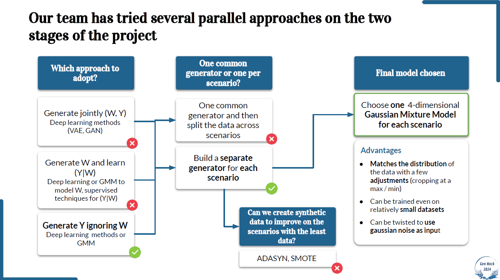
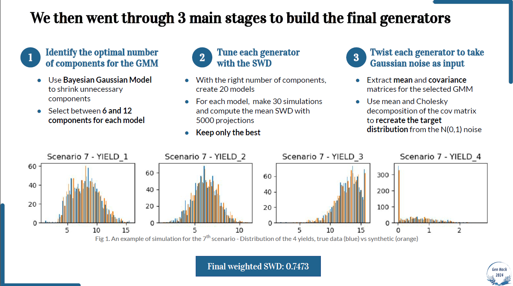

# Genhack3 Hackathon - Team crazy_farmers

This repository was built for the [Genhack3 Hackathon](https://www.polytechnique.edu/en/genhack-3-hackathon-generative-modelling),  which our team won. The goal was to generate maize yields in different locations to simulate the impact of climate change on cereal production.   
Our solution relied on Gaussian Mixture Models (GMMs) that were tuned through several techniques.

    

 

**Table of Contents**
1. [Team](#1-team)
2. [Detailed presentation of the project](#2-detailed-presentation-of-the-project)
3. [Solution](#3-solution)

## 1. Team
- Ludovic Bossard @bossardl
- Ghali Chraibi @GhaliChraibi17 
- Matthieu Delsart @matthieudelsart
- François Lebrun @FrancoisLbrn
- Tim Valencony @tim-vlc

## 2. Project presentation

The details of the project objectives and evaluation can be found in the two `doc_eval` pdfs.

The original introduction to the project is the following:

> _Agriculture's exposure to climate impacts is not new, and farmers are the first witnesses and victims of these impacts. Increasingly early, intense and frequent heatwaves, changes in rainfall patterns and late frosts are having an increasingly harsh effect on agricultural production.
> Given the importance of this sector, there is an urgent need to define resilient solutions for the future climate and develop new tool._
>
> _Changes in the climate can be seen in episodes of heavy rainfall, drought, and temperatures which can undermine food security by slowing down growth on a global scale. This drought is specifically affecting many crops, particularly maize. Maize is the world's most important cereal crop, making it an essential resource for millions of people._
>
> _**The purpose of this challenge is to build a spatial generator of annual maize yield.**_

> This repository contains the files required in the GenHack3 challenge. It contains:
> - `data/`: folder containing the training data (`station49.csv`, `station80.csv`, `station40.csv`, `station63.csv`) and a noise file (` noise.npy`)
> - `requirements.txt`: text file containing the libraries with their associated versions you used in the `model.py` file 
> - `Dockerfile`: docker image in order to create a container
> - `main.py`:  main python file containing the simulation function
> - `model.py`: python file containing your generative model and for loading the parameters
> - `parameters/`: folder where you **must** put the parameters of your model
> - `run.sh`: bash script to run your simulation

## 3. Solution
The following 2 slides are from the presentation we did at the award ceremony, they explain our investigation process and the final model we implemented.

